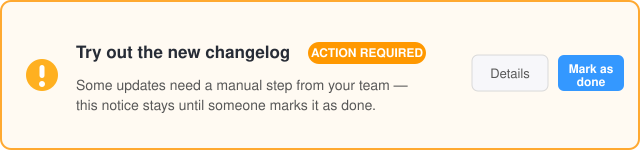

Les mises à jour qui demandent une étape manuelle (par exemple ajouter un
nouveau bloc à votre navigation) apparaissent comme un avis mis en évidence en
haut du tableau de bord, comme celui-ci :

L'avis reste visible pour toute votre équipe jusqu'à ce que quelqu'un confirme
que l'étape a été effectuée :

1. Lisez ce qu'il faut faire – **Détails** ouvre la description complète.
2. Effectuez l'étape dans votre instance.
3. Cliquez sur **Marquer comme effectué** et confirmez. L'avis disparaît pour
   tout le monde, et la personne qui a confirmé est enregistrée.

**Votre tâche pour cette entrée :** il n'y a rien d'autre à configurer –
cliquez simplement sur **Marquer comme effectué** pour essayer le processus.
